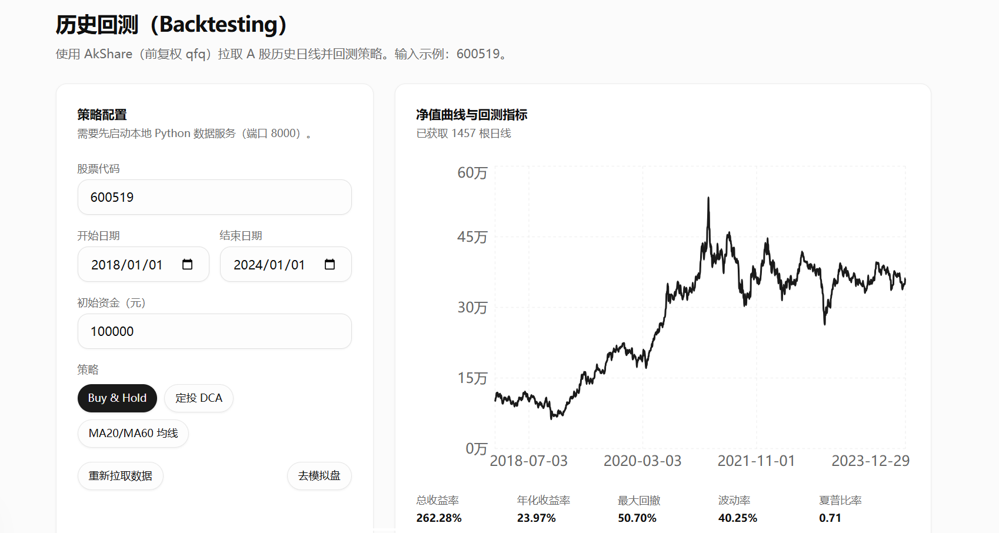
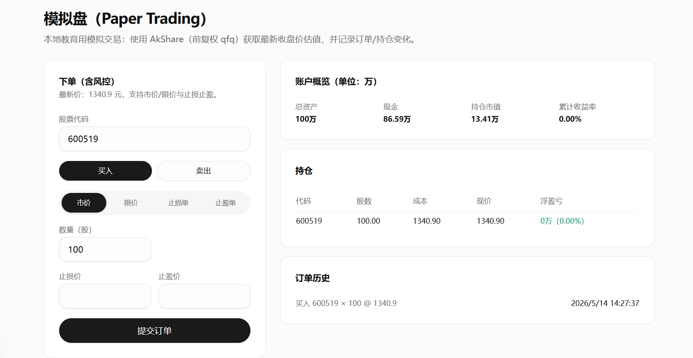
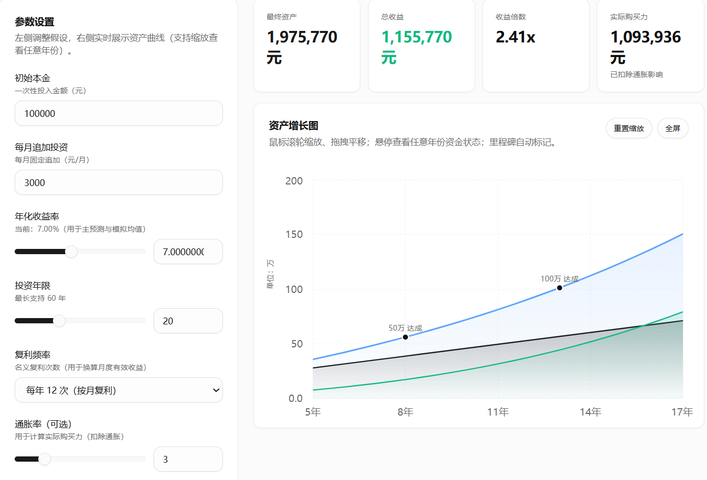

# FinLounge

一个面向长期投资学习与演练的 Web 项目。它把知识阅读、智能问答、复利计算、历史回测、模拟盘和组合分析放到同一条体验链路里，目标不是替用户做判断，而是帮助用户把判断过程练出来。

这已经不是一个通用的 `shadcn` 模板，而是一套正在成形的投资学习产品原型，主技术栈为 `Next.js 15 + React 19 + shadcn/ui + Supabase + AkShare`。

## 项目预览

[点击观看 Demo 视频](./public/readme/demo.mp4)







## 项目简介

FinLounge 试图把投资学习拆成几个更具体的动作：

- 先理解概念：知识库和文章内容负责打基础
- 再提出问题：聊天助手承接常见理财与投资问答
- 再做计算：复利、定投、组合指标等工具把模糊想法量化
- 再做演练：历史回测和模拟盘帮助用户先验证、后行动

首页和导航目前已经围绕这条链路组织了主要模块。

## 核心能力

- `智能助手`：`/chat`，通过服务端路由对接 Dify 流式聊天接口
- `理财百科`：`/knowledge`，内置知识内容，适合做基础概念学习
- `复利工具`：`/tools/compound`，用于收益、追加投入、购买力等测算
- `历史回测`：`/tools/backtest`，依赖本地或远程 Python 行情服务
- `模拟盘`：`/tools/paper`，用于练习持仓和交易流程
- `组合分析`：`/tools/analytics`，基于组合数据计算关键指标
- `个股详情`：`/stocks/[symbol]`，作为行情与扩展能力入口

## 技术栈

- 前端：`Next.js 15`、`React 19`、`TypeScript`
- UI：`Tailwind CSS`、`shadcn/ui`、`lucide-react`
- 图表：`recharts`、`echarts`
- 数据与状态：`@tanstack/react-query`
- 认证与数据存储：`Supabase`
- 智能问答：`Dify API`
- 行情服务：`FastAPI + AkShare`（位于 `python-data-service/`）

## 快速开始

### 1. 安装依赖

```bash
npm install
```

### 2. 创建环境变量

在项目根目录创建 `.env.local`：

```ini
# Dify：聊天助手使用
DIFY_API_KEY=your_dify_api_key
DIFY_API_BASE_URL=https://api.dify.ai/v1

# Supabase：登录、模拟盘、组合分析等能力使用
NEXT_PUBLIC_SUPABASE_URL=https://your-project.supabase.co
NEXT_PUBLIC_SUPABASE_ANON_KEY=your_supabase_anon_key

# 行情服务：不填时默认使用 http://127.0.0.1:8000
MARKET_DATA_SERVICE_URL=http://127.0.0.1:8000
```

### 3. 启动前端

```bash
npm run dev
```

默认访问：`http://localhost:3000`

### 4. 可选：启动 Python 行情服务

如果你要使用历史回测或依赖行情接口的功能，再启动 `python-data-service`：

```powershell
cd python-data-service
python -m venv .venv
.\.venv\Scripts\activate
python -m pip install -r requirements.txt
python -m uvicorn main:app --reload --port 8000
```

健康检查地址：

```text
http://127.0.0.1:8000/api/health
```

历史行情示例：

```text
http://127.0.0.1:8000/api/ashare/historical?symbol=600519&startDate=2018-01-01&endDate=2024-01-01&adjust=qfq
```

## 运行要求

不同能力依赖的服务不同，大致可以这样理解：

- 只看首页或做纯前端开发：前端启动即可
- 使用 `智能助手`：需要配置 `DIFY_API_KEY` 和 `DIFY_API_BASE_URL`
- 使用 `模拟盘`、`组合分析`、登录注册：建议先配置 `Supabase`
- 使用 `历史回测`：需要 Python 行情服务可用

## 目录说明

```text
app/                    Next.js App Router 页面与 API
components/             页面组件与 UI 组件
data/                   知识库等静态数据
docs/                   PRD、设计文档等项目说明
lib/                    业务逻辑、数据引擎、Supabase 和工具函数
public/                 静态资源
python-data-service/    FastAPI + AkShare 行情服务
```

## 主要路由

- `/`：首页
- `/chat`：智能助手
- `/knowledge`：理财百科
- `/tools`：工具入口，当前会重定向到 `/tools/compound`
- `/tools/compound`：复利计算
- `/tools/backtest`：历史回测
- `/tools/paper`：模拟盘
- `/tools/analytics`：组合分析
- `/stocks/[symbol]`：个股详情
- `/login`、`/register`、`/login-otp`：认证相关页面

## 部署建议

推荐拆成两部分部署：

1. `Next.js` 前端与 API 路由部署到 `Vercel`
2. `python-data-service` 部署到可公网访问的 Python 环境

前端环境变量至少要覆盖：

- `NEXT_PUBLIC_SUPABASE_URL`
- `NEXT_PUBLIC_SUPABASE_ANON_KEY`
- `DIFY_API_KEY`
- `DIFY_API_BASE_URL`
- `MARKET_DATA_SERVICE_URL`

注意：线上环境不能依赖本机的 `127.0.0.1:8000`。生产环境必须把 `MARKET_DATA_SERVICE_URL` 指向真实可访问的服务地址。

## 当前状态

这个仓库已经具备产品原型的骨架，但仍处在持续迭代阶段，现阶段更适合：

- 继续作为投资学习产品的底座开发
- 作为 `Next.js + Supabase + Dify + Python` 组合方案的参考实现
- 作为个人项目或小团队验证交互链路与工具模块的起点

同时也有几件事值得提前知道：

- 仓库里仍有一些历史模板痕迹和旧文案
- 某些能力已经具备页面和数据流，但产品细节还在继续收敛
- Python 行情服务是独立子目录，不会随前端自动启动

## 相关文件

- `docs/prd.md`：产品需求草稿
- `supabase-schema.sql`：Supabase 数据结构参考
- `dify-agent-prompt.md`：Dify 相关提示词草稿

## License

如需开源发布，建议在这里补充明确的许可证信息。
